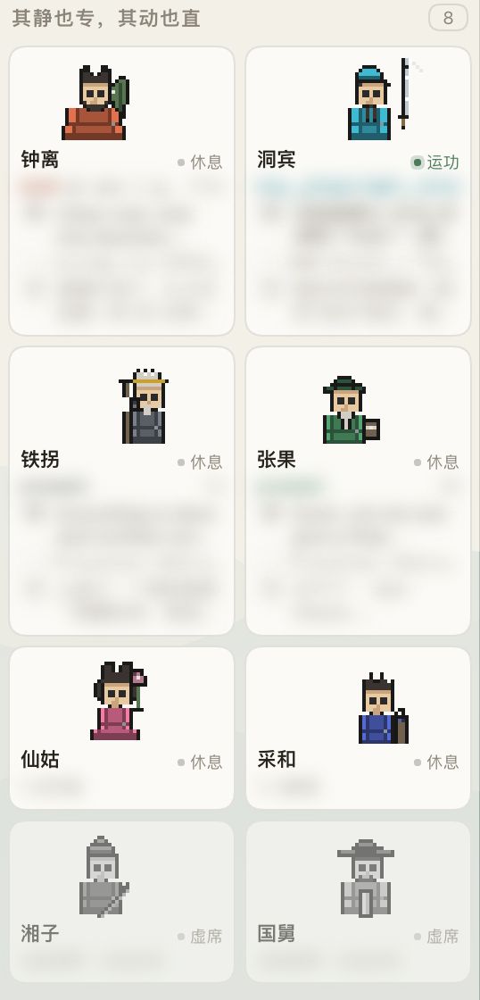

# 定员八席 · Eight Standing Seats

> **其静也专，其动也直。** —— 《周易 · 系辞上》
>
> 把 DeepSeek Harness 的侧栏换成 2×4 的常驻席位看板：八个 agent 在干什么、哪一席在等你，一眼看全。

**中文** ｜ [English](README.md)

[](https://www.npmjs.com/package/dsh-agent-grid)
[](#license)
[](https://github.com/topics/dsh-plugin)
[](#兼容性)

---



> 这是**真实运行截图**，不是示意图：八席各自的头像、状态点与当前动作（洞宾「运功」亮绿点，湘子 / 国舅「虚席」灰掉）。*卡片上的动态文字与工作目录已打码。*

## 它解决什么

DSH 的侧栏默认是**会话列表**。当你一个 agent 一个会话时，你想知道的不是"有哪些会话"，而是「**哪一席在干什么、哪一席在等我**」—— 列表答不了这个问题，它只会越堆越长。

八席把它换成固定的 2×4 网格：

> **槽位身份常驻，会话是可抛弃的负载。**

八个槽位的身份（人设 / 主色 / 编号）永久固定，真实会话只是挂在槽位上的**可替换负载**。会话增删、排序变化都不会让格子换人 —— 这是这块板能"扫一眼就懂"的前提。

八席各有名号与法宝（汉钟离 · 吕洞宾 · 铁拐李 · 张果老 · 何仙姑 · 蓝采和 · 韩湘子 · 曹国舅），每人一套像素头像（56×24 逻辑画布 @2× 整数放大）。**动画是有限状态机，不是循环 GIF** —— 小人的姿势跟着事实走：等你 → 举旗，干活 → 法宝出效，待过目 → 归位余晖，其余 → 收起静止。

## 三个正交状态

**不塞进一个字段**，因为它们的变化频率和负责人完全不同：

| 维度 | 取值 | 变化频率 | 谁改 |
| --- | --- | --- | --- |
| **人设** | 姓名 / 道具 / 主色 | 几乎不变 | 你 |
| **活动** | 运功 / 休息 / 待答 / 待裁 | 高频 | agent |
| **上下文** | 空 / 使用中 / 接近上限 | 中频 | 系统 |

关键推论：**「休息」≠「虚席」**。休息是"有身份、已就绪、没在干活"；虚席是"这个位置还没启用"。一个 bot 完全可以「休息但上下文 87% 满」—— 卡片必须提示，因为下次派活前得先清。

## 七种状态

| 标签 | 什么事实 | 判定来源 | 小人 |
| --- | --- | --- | --- |
| **虚席** | 这一席还没绑会话 | 无绑定 | 收起（灰） |
| **待命** | 已就位，会话还是空的 | `blank` | 收起 |
| **运功** | 正在干活 | `running` | 本位编排 |
| **待过目** | 有一轮结束了、**你还没看过** | 未读提醒 | 归位 + 金光余晖 |
| **休息** | 闲置，没有未读结果 | 其余 | 收起 |
| **待答** | 它抛了问题卡住，等你回话 | 投影 `attention=question` | 举旗 |
| **待裁** | 有未审的审批卡住，等你定夺 | 投影 `attention=approval` | 举旗 |

状态点配色：运功 **绿** · 待过目 **金** `#C9A227`  · 待答 / 待裁 **朱砂** `#B5453C`  · 虚席 / 待命 / 休息 **灰**

优先级：`待答 / 待裁` 盖过一切（除虚席）；其余按 运功 → 待过目 → 待命 → 休息。

> **为什么不叫「已完成」**：`completed` 不是生命周期，是**未读提醒** —— 平台在 `running` 的 true→false 边沿点亮，**不判成败**（跑挂了、被中断了同样点亮）。
> 叫「已完成」不只是不够准，而是**可能说错**。它真正只说了两件事：有一轮结束了、你还没看过。
>
> 另外，你正看着的那一席跑完**不会**点亮提醒 —— 所以「待过目」必然出现在你没在看的席位上。这恰好是八席看板替你盯着的那部分。

## 卡片上能看到过程

不是只有一个状态点。host 侧 `seat-activity` 投影提供每席最近一段：**工具调用 → 想（reasoning）→ ↳（工具结果）→ 说（正文）**，外加"距上次活动多久"。

所以八张卡同时动起来时，你能看出**每一席各自在做什么**，而不是八个一样的转圈。

> 竖向高度是硬约束：八席全满也要一屏放得下、不出现滚动条。实测单卡 164px、4 行卡 + 间隙 = 697px，可用高约 750px —— 所以窄窗口会自动收起「↳」等次要行，宁可少显示一行，也不要滚动条。

## 主栏保留原装

八席**不重写对话区**。主栏仍是 DSH 原装的 Conversation，只在对话头注入一枚**席位徽章**，让你随时知道"正在跟哪一席说话"。

（早期版本把主栏做成自制详情页，等于把原装对话扔了 —— 那是造轮子，已推翻。）

## 逃生开关

**设置 → 通用 → 侧边栏**：`[ 仙班 │ 默认 ]`

切回「默认」用的是**卸载注册**，不是隐藏组件 —— `dispose()` 掉我们的槽位注册后，内置的 `WorkspaceBrowser` 自动回到渲染位。刷新页面、服务器重启都保持；部署里没有 settings 服务时降级为本地开关，行内提示改为「当前无法持久化，重启后复原」。

## 安装

```bash
dsh plugin --profile web add dsh-agent-grid
```

刷新页面即可。想切回原生侧栏：**设置 → 通用 → 侧边栏 → 默认**。

## 侵入性声明

这个插件会**替换宿主的 `sidebar.workspaces` 槽位**（以 `priority: -1` 遮蔽内置实现）。它不修改宿主源码，但确实改变了侧栏的呈现方式 —— 上面那个开关就是为此准备的降级路径。

## 兼容性

- 验证于 **DSH 0.1.5-rc.2**（`@deepseek-ai/dsh`）
- 只消费宿主的设计 token，不写死配色 —— 因此**任何 DSH 主题都能作用于它**
- 与 DeepSeek 官方无隶属关系（Not affiliated with DeepSeek）

## 配合主题

配套主题 **[dsh-theme-songgrid](https://github.com/yefengliu1/dsh-theme-songgrid)**（宋律 · 宣纸 / 夜墨）就是为它调的：宣纸暖白配八席的灰阶卡片，汝窑天青承担交互态。两者完全独立，装任意一个都能用。

## License

MIT
